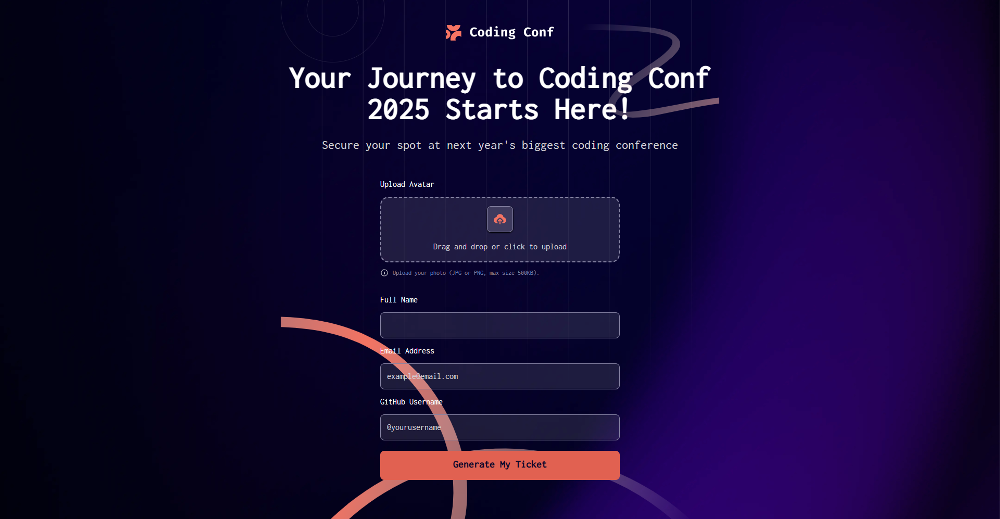
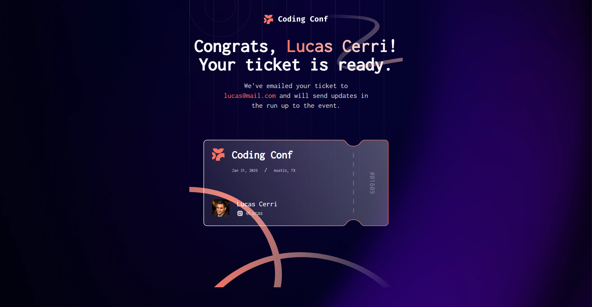

# Frontend Mentor - Conference ticket generator solution

This is a solution to the [Conference ticket generator challenge on Frontend Mentor](https://www.frontendmentor.io/challenges/conference-ticket-generator-oq5gFIU12w). Frontend Mentor challenges help you improve your coding skills by building realistic projects.

## Table of contents

- [Overview](#overview)
  - [The challenge](#the-challenge)
  - [Screenshot](#screenshot)
  - [Links](#links)
- [My process](#my-process)
  - [Built with](#built-with)
  - [What I learned](#what-i-learned)
  - [Continued development](#continued-development)
- [Author](#author)

## Overview

### The challenge

Users should be able to:

- Complete the form with their details
- Receive form validation messages if:
  - Any field is missed
  - The email address is not formatted correctly
  - The avatar upload is too big or the wrong image format
- Complete the form only using their keyboard
- Have inputs, form field hints, and error messages announced on their screen reader
- See the generated conference ticket when they successfully submit the form
- View the optimal layout for the interface depending on their device's screen size
- See hover and focus states for all interactive elements on the page

### Screenshot

### Links

- Solution URL: (https://github.com/llKryptonixll/conference-ticket-generator-main)
- Live Site URL: (https://fm-conference-ticket.netlify.app)

## My process

### Built with

- Semantic HTML5 markup
- Vanilla Javascript
- [Tailwind CSS](https://tailwindcss.com) CSS Framework

## What I Learned

Throughout this project, I made great progress in two areas: **drag and drop functionality** and **accessibility best practices**.

### Drag & Drop Upload

I learned how to:

- Use `DataTransfer` to assign a file to a hidden file input
- Use `FileReader` to preview images before uploading

### Continued development

One area I want to continue improving is **accessibility**. I’ve been actively working on writing more accessible HTML and ensuring better experiences for all users. While I’ve made solid progress, I know there’s always more to learn.

I'm especially interested in:

- Writing cleaner, more semantic markup
- Using ARIA roles and attributes effectively
- Making all interactions fully keyboard-accessible

If you spot anything in my code that could be improved from an accessibility standpoint, I’d be genuinely happy to hear your suggestions. I'm committed to building inclusive interfaces and welcome any feedback that helps me get there.

## Author

- Website - [Lucas Cerri](https://cerri-webdev.com/)
- Frontend Mentor - [@llKryptonixll](https://www.frontendmentor.io/profile/llKryptonixll)
